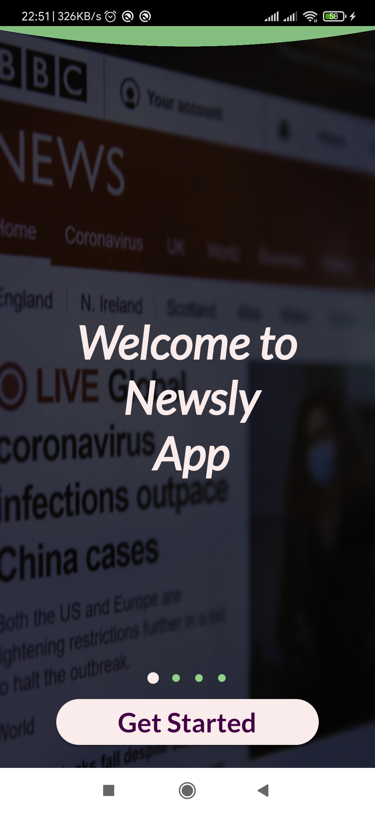
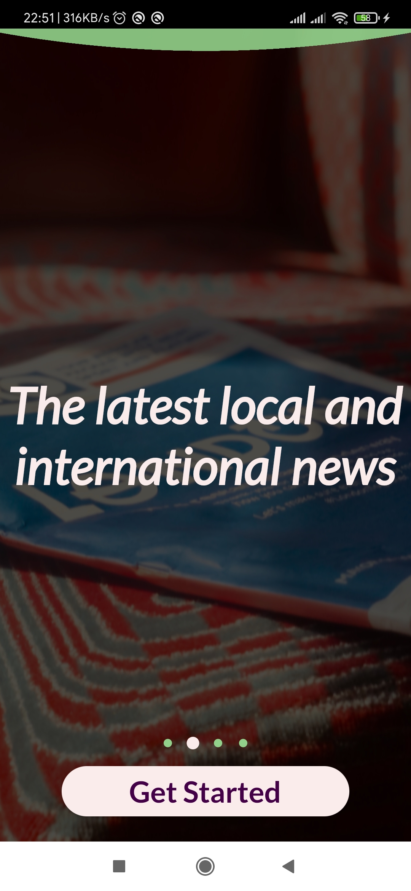
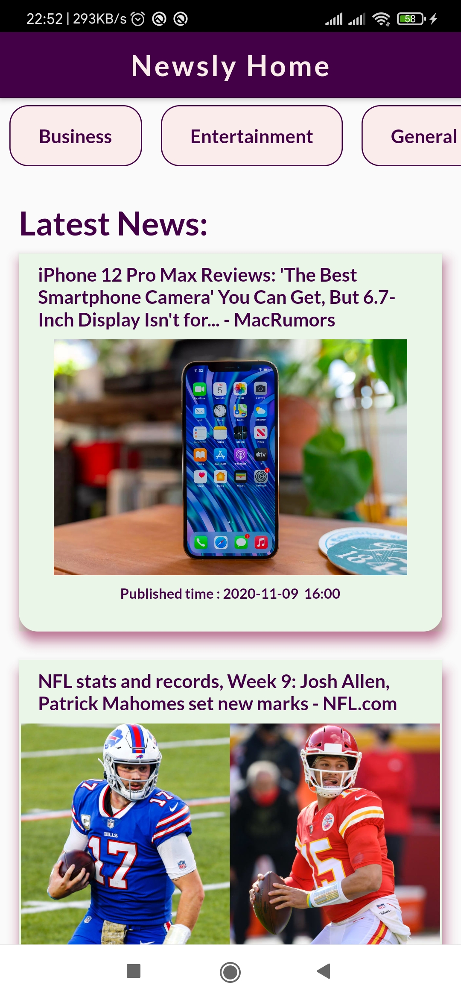
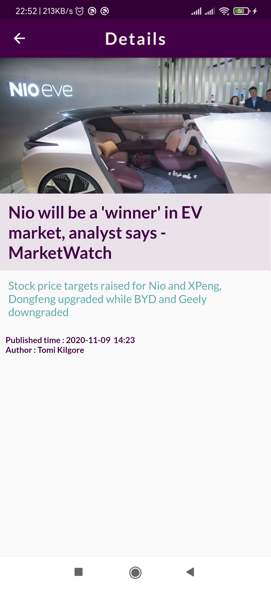
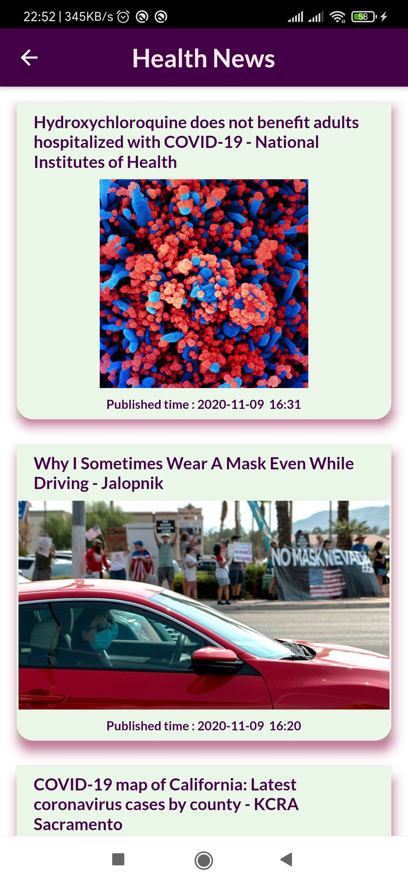
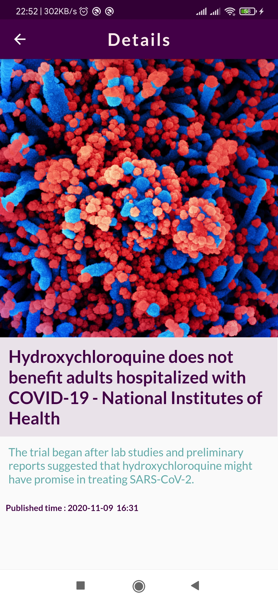

# Newsly App
***********************************************************************************
** Newsly APP get the latest news, connecting to REST API real data with flutter plugins.**
***********************************************************************************

## ScreenShot

